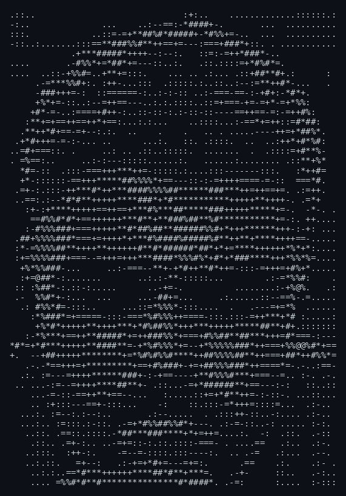

<div align="center">

```
ahmed@github ~ $ ./contributions.sh
```


```
ahmed@github ~ $ whoami
```

</div>

<table>
  <tr>
    <td width="42%" valign="top">
      
    </td>
    <td width="58%" valign="top">

**Ahmed Magdy**
`AhmedDR200`

> Backend engineer building scalable APIs and cloud-based systems with Node.js, Express.js & NestJS.

- 📍 Egypt
- 🏢 Freelance · Software Engineering, Mansoura University
- 📫 [alshwwhy212@gmail.com](mailto:alshwwhy212@gmail.com)
- 🔗 [magdy.digital](https://magdy.digital)
- 📄 [Resume](https://flowcv.com/resume/srkw1oiilq)


</td>
  </tr>
</table>

<div align="center">

```
ahmed@github ~ $ ./links.sh
```

[](https://linkedin.com/in/am412002)
[](https://leetcode.com/AhmedDR200)
[](https://magdy.digital)

</div>
