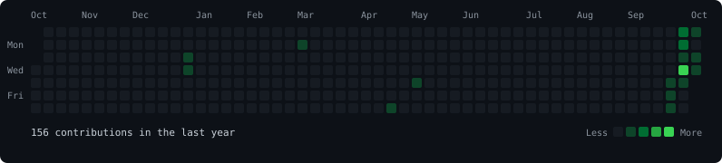

<table>
  <tr>
    <td width="38%" valign="top">
      
    </td>
    <td width="62%" valign="top">

`location` Egypt 
`work    ` Freelance backend engineer 
`study   ` Software Engineering, Mansoura University 
`email   ` [alshwwhy212@gmail.com](mailto:alshwwhy212@gmail.com) 
`web     ` [magdy.digital](https://magdy.digital) 
`resume  ` [flowcv.com/resume](https://flowcv.com/resume/srkw1oiilq)

</td>
  </tr>
</table>

